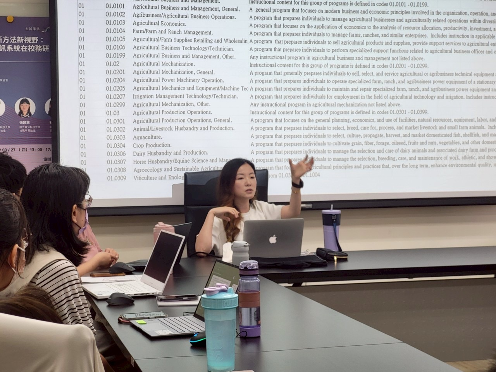

Served as an instructor for the session on generative AI in a professional workshop on emerging technologies in institutional research.

The workshop introduced innovative approaches to applying generative AI and geographic information systems (GIS) in higher education and institutional research.

My session focused on:

- Applications of generative AI in institutional research  
- Practical use cases of large language models (LLMs)  
- Integrating AI tools into data analysis workflows  

The workshop emphasized practical, hands-on applications and aimed to equip participants with new analytical perspectives and tools for data-driven decision-making in higher education.

