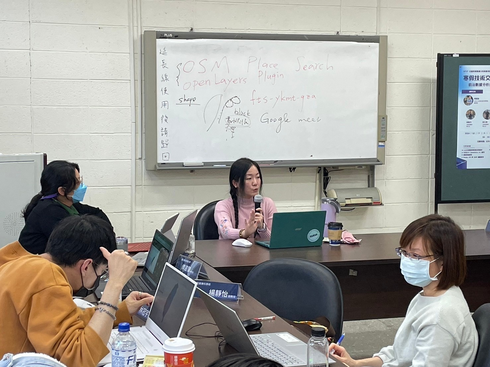
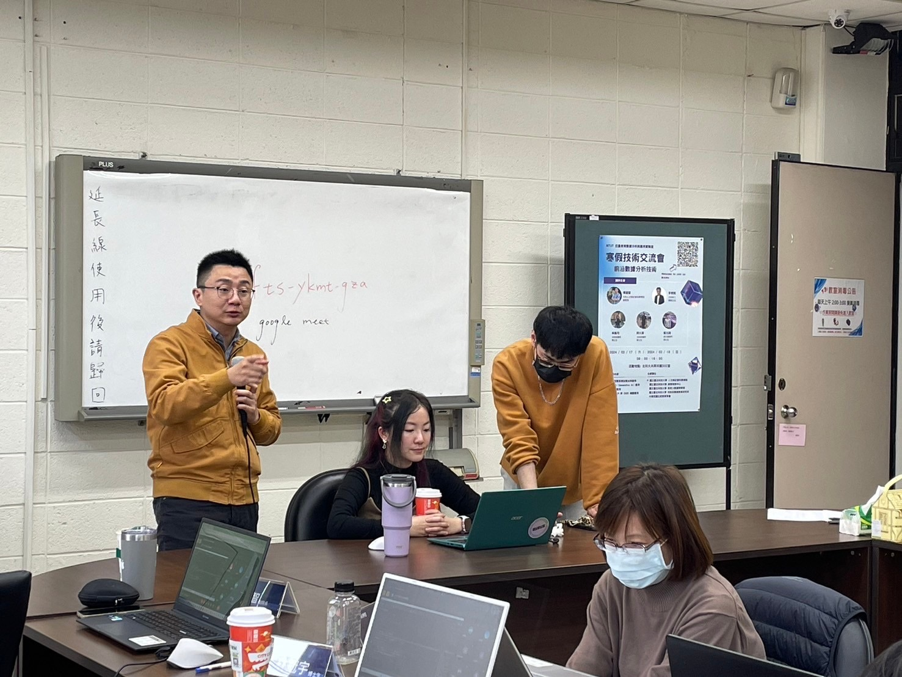

Served as an instructor in a two-day workshop on advanced data analytics.

The workshop focused on practical applications of data-driven methods, covering:

- Generative AI applications  
- Web scraping techniques  
- GIS analysis using QGIS  

The course emphasized hands-on learning and real-world data analysis, equipping participants with practical skills in emerging data science tools and technologies.

