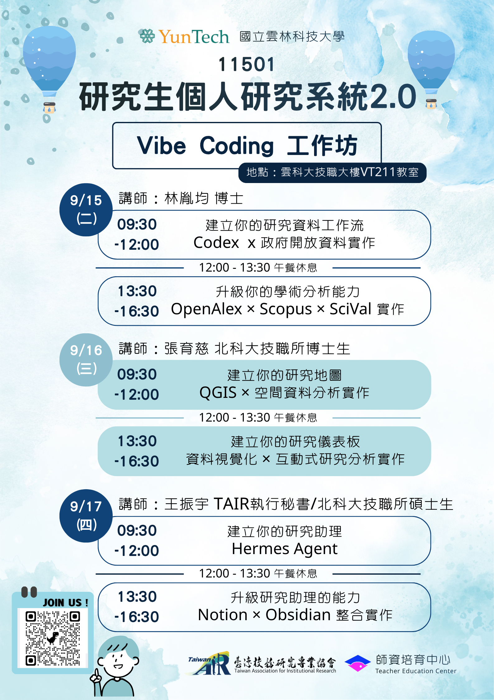
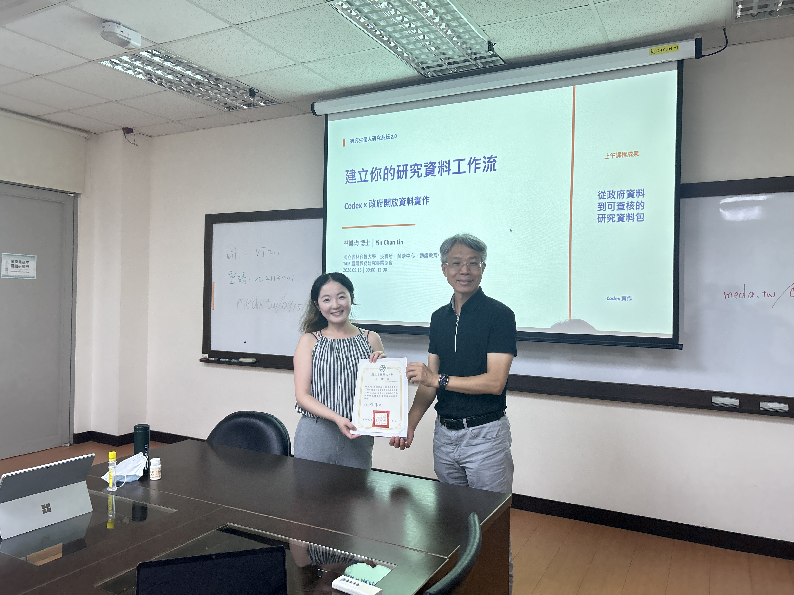

Served as the Day 1 instructor for the "Vibe Coding Workshop" (Graduate Student Personal Research System 2.0), hosted at National Yunlin University of Science and Technology, co-organized with the Taiwan Association for Institutional Research (TAIR).

My sessions on September 15 covered:

- **Morning** — Building your research data workflow: Codex × government open data in practice
- **Afternoon** — Upgrading your academic analysis skills: OpenAlex × Scopus × SciVal in practice

The workshop focused on hands-on, reproducible research workflows for graduate students, from raw government open data to verifiable research data packages and academic analytics.

